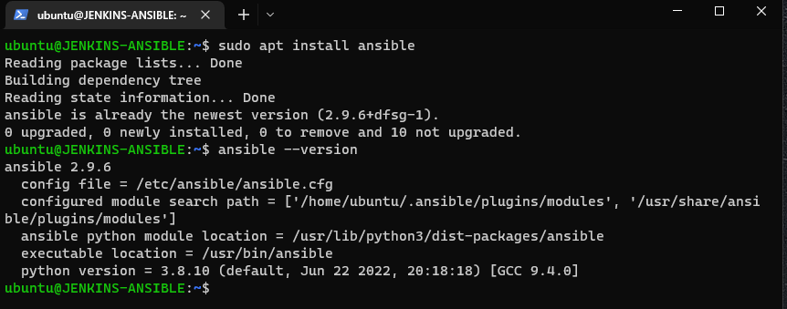

# PECTOR DOCUMENTATION FOR THE ELEVENTH PROJECT
Update Name tag on your Jenkins EC2 Instance to Jenkins-Ansible. We will use this server to run playbooks.
In your GitHub account create a new repository and name it ansible-config-mgt.
Instal Ansible `sudo apt update`
`sudo apt install ansible` 
`ls /var/lib/jenkins/jobs/ansible/builds/<build_number>/archive/` using this command, I Test my setup by making some change in README.MD file in master branch and make sure that builds starts automatically and Jenkins saves the files build artifacts , 
An Ansible inventory file defines the hosts and groups of hosts upon which commands, modules, and tasks in a playbook operate. Since our intention is to execute Linux commands on remote hosts, and ensure that it is the intended configuration on a particular server that occurs. It is important to have a way to organize our hosts in such an Inventory.

Save below inventory structure in the inventory/dev file to start configuring your development servers. Ensure to replace the IP addresses according to your own setup.

Note: Ansible uses TCP port 22 by default, which means it needs to ssh into target servers from Jenkins-Ansible host – for this you can implement the concept of ssh-agent. Now you need to import your key into ssh-agent: `eval ssh-agent -s`
`ssh-add <path-to-private-key>`
confirm if key has been added `ssh-add -l`, ssh into your Jenkins-Ansible server using ssh-agent
`ssh -A ubuntu@public-ip` Update your inventory/dev.yml file with this snippet of code in the documentation.
thereafter commit my code into the github, I ran git status `git add <selected files>` `git commit -m "commit message"`
According to the documentation, Create a Pull request (PR)

Wear a hat of another developer for a second, and act as a reviewer.

If the reviewer is happy with your new feature development, merge the code to the master branch.

Head back on your terminal, checkout from the feature branch into the master, and pull down the latest changes.

Once your code changes appear in master branch – Jenkins will do its job and save all the files (build artifacts) to `/var/lib/jenkins/jobs/ansible/builds/<build_number>/archive/ directory on Jenkins-Ansible server` 
I ran this to  run first anisble test `cd ansible-config-mgt`
`ansible-playbook -i inventory/dev.yml playbooks/common.yml` 

THANK YOU!